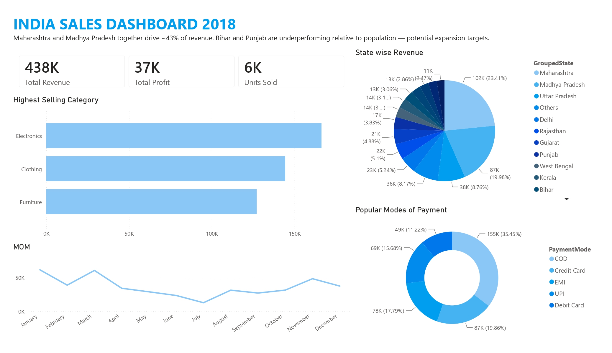

# India Sales Analysis and Power BI Dashboard
End-to-end data analysis project: cleaning and exploring sales data with Python, then building an interactive Power BI dashboard for business insights.

### 📁 Project Overview
This project analyzes 1,500 retail orders placed across India in 2018, covering Electronics, Furniture, and Clothing categories. The workflow goes from raw CSV → Python-based EDA → a polished, interactive Power BI dashboard.

**Goal**: Identify revenue and profit trends, top-performing categories/states, and customer payment behavior.

**Questions answered**
- Which category generated high revenue?
- In whcih Quarter revenue was the highest?
- Which is highest/lowest revenue generating state?
- Which are top perfoming cities?
- Which is popular payment mode?
- Which payment mode has high revenue?
- Who are repeated customers?
- which customers shoped more than average?

### 🗂️ Dataset
link: https://www.kaggle.com/datasets/samruddhi4040/online-sales-data

### 🛠️ Tech Stack
- Python 3 — data cleaning & exploratory analysis
  - pandas — data wrangling
  - matplotlib / seaborn — visualization during EDA
- Power BI Desktop — interactive dashboard & reporting
- DAX — calculated measures inside Power BI

## 📊 Dashboard Preview

### 🔑 Key Insights to Highlight
- Revenue and profit contribution by Category and Sub-Category
- Seasonal/monthly sales trends across 2018
- State-wise performance (top revenue-generating regions)
- Customer payment mode preferences
- Profit margin consistency across product categories
